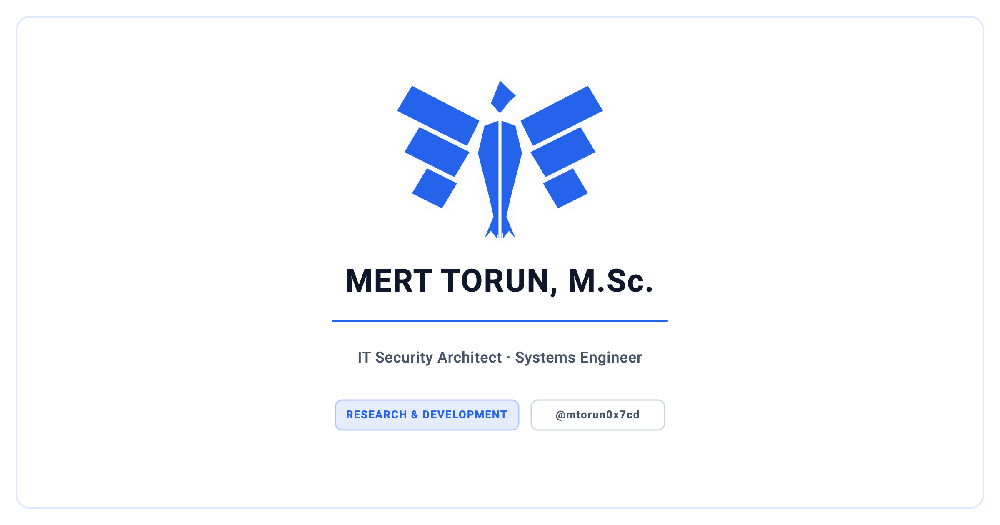

<p align="center">
  <picture>
    <source media="(prefers-color-scheme: dark)" srcset="docs/social_preview_dark.png" />
    <source media="(prefers-color-scheme: light)" srcset="docs/social_preview_light.png" />
    
  </picture>
</p>

# Mert Torun, M.Sc. <!-- markdownlint-disable-line MD026 -->

## IT Security Architect · Systems Engineer

<p align="center">
  
  
  
  
</p>

I am an IT Security Architect & Systems Engineer holding an M.Sc. in Computer Science & Engineering from TH Köln. My work concerns the conditions under which a system can be trusted: the verification and validation of safety-critical systems, the hardening of enterprise infrastructure, and the construction of cryptographic architectures that establish the integrity and authenticity of digital artifacts. I read these problems through the established assurance literature — functional-safety, software-verification, and security-evaluation standards — and treat their methods as a shared vocabulary rather than a checklist. The orienting question across these domains is the same: under what conditions can a system's claimed properties be demonstrated rather than asserted.

A second commitment runs through this work: that engineering claims should be reproducible and independently checkable. I operate self-hosted, privacy-respecting infrastructure end to end, cryptographically sign my commits, release tags, e-mail and the documents I issue, and maintain a public portal through which the authenticity of signed documents can be verified by anyone. I treat reproducibility as a property of the engineering itself, not a courtesy added afterward, and self-hosting as a methodological consequence rather than a preference: the provenance and integrity of an artifact are only as trustworthy as the chain that produced and serves it, and assertions of correctness or provenance carry weight only insofar as a third party can confirm them.

The repositories below span active research and MIT-licensed archives of completed academic and engineering work — embedded systems, web platforms, robotics, and cryptographic education. The archived projects are preserved as records rather than maintained as living tools, documented so that their methods and results remain legible after the work has closed; the active repositories accompany research still in progress.

---

## Selected Repositories

- **[anti-skid-verification](https://github.com/mtorun0x7cd/anti-skid-verification)** — two-layer functional-equivalence verification for safety-critical FPGA rail retrofits (IEC 61508 / IEEE 1012); active research, paper forthcoming.
- **[thesis-fentwums-container-extension](https://github.com/mtorun0x7cd/thesis-fentwums-container-extension)** — M.Sc. thesis: the report and the cross-platform evaluation apparatus for the container extension below, benchmarking synthesis, place-and-route and simulation across iCE40 and ECP5 with the upstream sources pinned as submodules.
- **[FEntwumS.ContainerExtension](https://github.com/FEntwumS/FEntwumS.ContainerExtension)** — OneWare Studio plugin routing FPGA/EDA toolchains (GHDL, Yosys, nextpnr, Verilator, Icarus Verilog) through ephemeral Docker/Podman containers with a native-host fallback and pinned-image reproducibility; the extension the thesis evaluates, contributed to the FEntwumS project (active research).
- **[coupon-management](https://github.com/mtorun0x7cd/coupon-management)** — Django platform with polyglot persistence and a reproducible PostgreSQL/MongoDB benchmark.
- **[nao-ball-pickup](https://github.com/mtorun0x7cd/nao-ball-pickup)** — vision-guided ball detection and pickup for the SoftBank NAO 6 humanoid.
- **[raven-one-simulink](https://github.com/mtorun0x7cd/raven-one-simulink)** — educational RSA and MD5 simulator exposing every intermediate computation (RFC 8017 / RFC 1321).
- **[warehouse-management-system](https://github.com/mtorun0x7cd/warehouse-management-system)** — multi-tier Java Swing warehouse client over JPA/MySQL.

---

## Cryptographic Verification & Security

The documents I issue, my e-mail, and the commits and tags in the repositories under this account are cryptographically signed, so their authenticity, integrity, and origin can be demonstrated rather than asserted. Two independent mechanisms are used, each verifiable on its own.

**Documents & e-mail** — official PDF documents and e-mail are signed with an S/MIME certificate.

- **Verify**: check a signature in real time at [mtorun0x7cd.com/verify](https://mtorun0x7cd.com/verify), or download the public [S/MIME certificate](https://mtorun0x7cd.com/assets/certs/smime.cer) and [key policy](https://mtorun0x7cd.com/legal#smime).
- **Certificate fingerprint** — confirm the certificate for `info@mtorun0x7cd.com` (issued by D-Trust SBR CA 1-22-1 2022) against its SHA-256 fingerprint before trusting it:

    ```text
    11:BC:CF:B3:93:93:06:17:E5:95:87:8A:00:B3:82:43:AC:76:13:00:3E:3A:76:0E:98:B2:AA:05:BF:AD:55:A5
    ```

**Code** — commits and tags in the repositories under this account are signed with an SSH key; GitHub renders these as **Verified**.

- **Signing-key fingerprint** — the Ed25519 signing key is published on the [verification portal](https://mtorun0x7cd.com/verify) and at [`/users/mtorun0x7cd/ssh_signing_keys`](https://api.github.com/users/mtorun0x7cd/ssh_signing_keys); confirm it against its SHA-256 fingerprint:

    ```text
    SHA256:h0XIy0K+hRkQ921LjtoKu/jSPvvlP0r4BiAMuyEPIrI
    ```

---

## Support & Sponsorship

If you find my work or research valuable, you can support it:

- **Sponsor on GitHub**: Support me via [GitHub Sponsors](https://github.com/sponsors/mtorun0x7cd).
- **Buy Me a Coffee**: Send a one-time or monthly contribution via [Buy Me a Coffee](https://buymeacoffee.com/mtorun0x7cd).
- **Cryptocurrency Donations**:
    <details>
    <summary>View Bitcoin (BTC) &amp; Monero (XMR) Addresses</summary>
    <br>

    **Bitcoin (BTC)**:

    ```text
    1JayXfpV9a3UxjUGVF3n6diD3MnBugnir9
    ```

    **Monero (XMR)**:

    ```text
    48rsHksR1PH2wBb8GChnBbdNXDMUVKb2S2jsgKyVoKJx7TAwJaTTcxHbSDePyBFyEPAxxW9YZA6j5HxEEkjn4e6KN85KUM3
    ```

    </details>
- **Support Portal**: For more details, visit [mtorun0x7cd.com/support](https://mtorun0x7cd.com/support).

---

## Contact

**Mert Torun, M.Sc.** — IT Security Architect · Systems Engineer  
mtorun0x7cd · Research & Development

- **Email**: [info@mtorun0x7cd.com](mailto:info@mtorun0x7cd.com)
- **Website**: [mtorun0x7cd.com](https://mtorun0x7cd.com)
- **LinkedIn**: [linkedin.com/in/mtorun0x7cd](https://www.linkedin.com/in/mtorun0x7cd)
- **GitHub**: [github.com/mtorun0x7cd](https://github.com/mtorun0x7cd)
